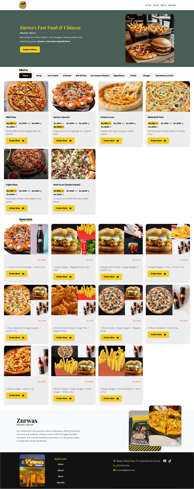

# 🍔 Zurwa's FastFood and Chinese Resturant

Zurwas Fast Food is a modern, responsive web application designed to provide a seamless online food ordering experience through whatsapp.  
Built with **React**, **Vite**, and **Tailwind CSS**, this app features an optimized UI, custom fonts, and a fast, mobile-first design.

## 🚀 Live Demo
Check out the live version of the project here:  
🔗 **[Zurwas Fast Food Live](https://your-netlify-url.netlify.app)**

## 📌 Features
- **Responsive Design** – Works flawlessly on mobile, tablet, and desktop.
- **Modern UI with Tailwind CSS** – Clean and maintainable styling.
- **Custom Fonts Integration** – Unique typography for brand consistency.
- **Optimized Images** – Fast loading performance.
- **React Components** – Modular and reusable design.
- **Vite Build Tool** – Lightning-fast development and production builds.
- **Add to Cart** -Clean Add to cart feature and checkout order on whatsapp.  

## 🛠️ Tech Stack

| Technology      | Purpose                |
|-----------------|------------------------|
| **React**       | Frontend framework     |
| **Vite**        | Fast development + build tool |
| **Tailwind CSS**| Styling and custom utility classes |
| **Netlify**     | Deployment and hosting |

## 📸 Screenshots

   [Hero](./public/screenshots/Hero.png)
   [Cart](./public/screenshots/Cart.png)
   [Menu](./public/screenshots/Menu.png)
   [Specials](./public/screenshots/Specials.png)
   [Mobile Responsive UI](./public/screenshots/MobileResponsive.png)

🧑‍💻 Author
**Samiullah**
LinkedIn: [Samiullah Hafeez](https://www.linkedin.com/in/samiullah-hafeez/)

